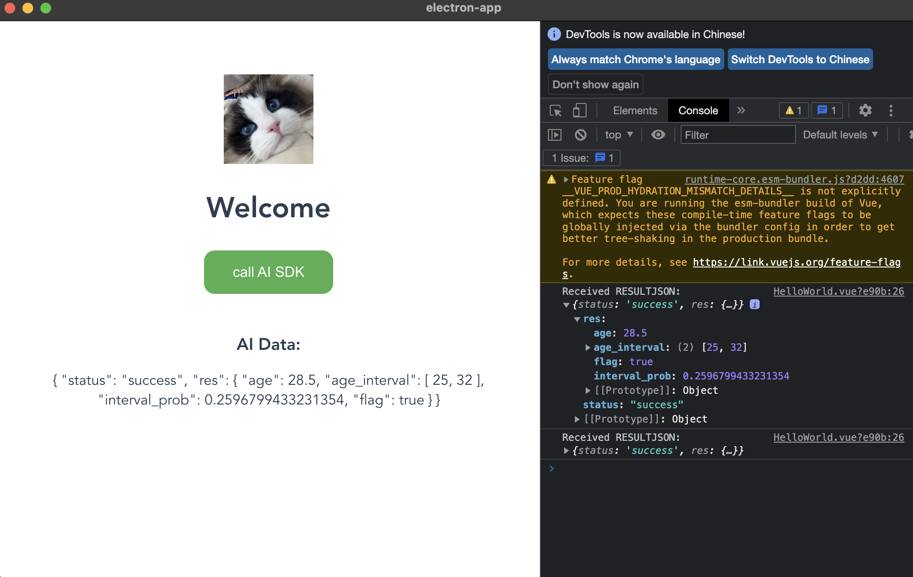

# MNN OpenCV Electron
Integrate the inference engines MNN & OpenCV into the Electron project, mainly use executable files for inference.          
The executable file transmits and reads data through console.log("RESULTJSON[", ageJson, "]").          

将推理引擎mnn & OpenCV 集成到electron项目,主要采取可执行文件进行推理            
可执行文件通过console.log("RESULTJSON[", ageJson, "]")进行数据传输和读取        



## Create New Electron Project

```sh
npm install -g @vue/cli
vue create electron-app
cd electron-app
vue add electron-builder
```

## Start
### build extraResources
```sh
mkdir bin
cd wasm-examples
npm install
npm run build:bin
```
### install
```sh
npm install
npm run electron:serve
```

## Build
```sh
npm run electron:build
```